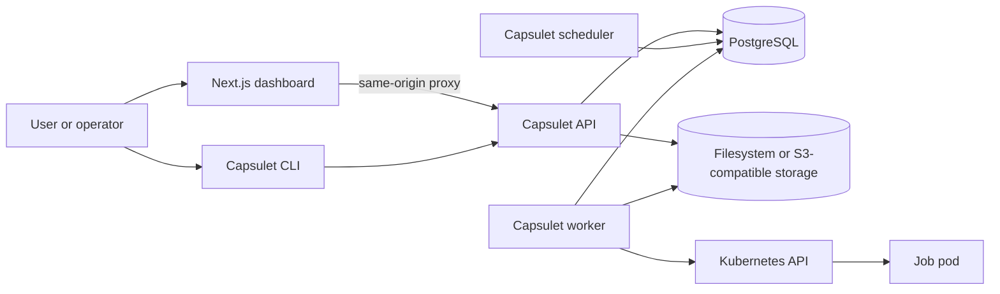
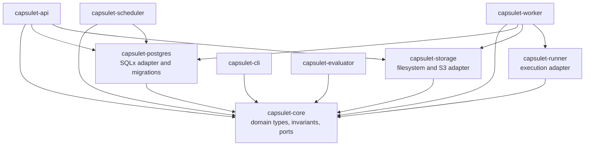
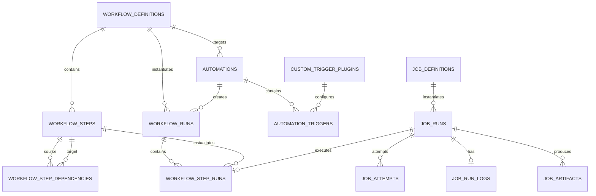
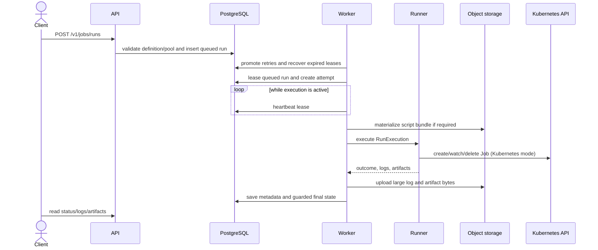
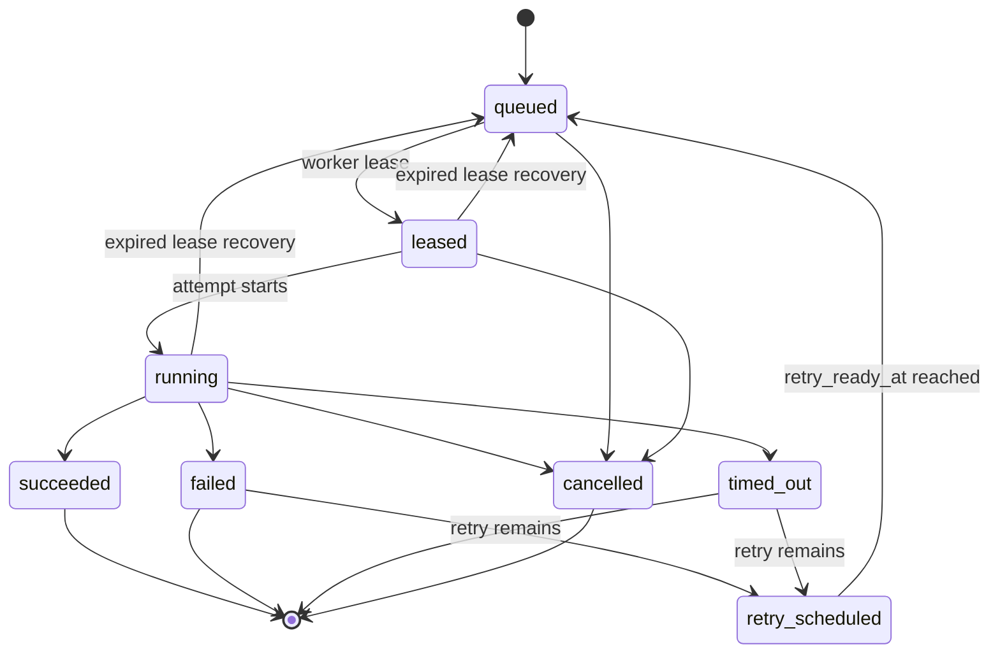
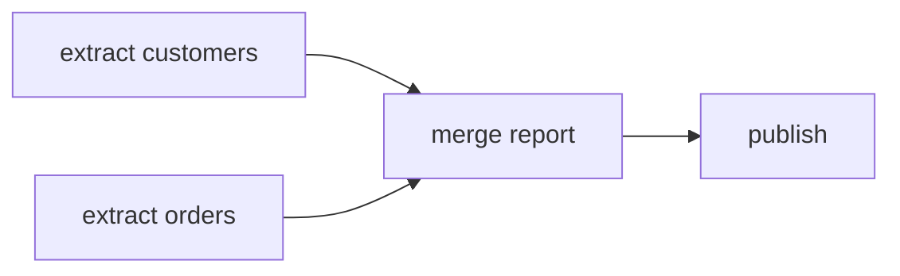

# Capsulet Architecture

This document describes the architecture implemented in this repository. Capsulet is an early-alpha, Kubernetes-native automation platform for defining Python jobs, composing them into workflow DAGs, triggering workflow runs, and retaining execution state, logs, and artifacts.

For a shorter operator-facing overview, see [docs/architecture.md](docs/architecture.md). Architecture decisions are recorded under [docs/adr](docs/adr).

## Scope and maturity

The current system provides a working PostgreSQL-backed control plane, a dashboard and CLI, filesystem or S3-compatible object storage, and stub, local-process, and Kubernetes Job execution backends. It is suitable for development and alpha evaluation.

The following are not implemented production guarantees: API authentication or authorization, webhook ingestion, runtime execution of SQL/custom triggers, evaluator-driven condition processing, event streaming, retention cleanup, pool concurrency enforcement, metrics, network policies, and Kubernetes Job reattachment after a worker restart.

## System context

PostgreSQL is the source of truth for definitions and execution state. Object storage owns script bytes, full large logs, and artifact bytes. Kubernetes owns pod placement and resource enforcement when the worker uses the Kubernetes runner.

## Runtime components

### API (`capsulet-api`)

The Axum API is the synchronous control-plane boundary. It:

- runs embedded SQLx migrations on startup, unless migration behavior is configured separately;
- creates, lists, reads, updates, and deletes job definitions;
- creates and reads workflow definitions, including dependency edges;
- manages automations, trigger definitions, and custom-trigger plugin metadata;
- creates manual job and workflow runs;
- exposes run filtering, logs, cancellation, workflow resume/removal, and artifact download;
- validates job input contracts, workflow graphs, trigger configuration, and condition trees;
- exposes `/livez`, `/readyz`, and the compatibility alias `/healthz`.

The API uses `capsulet-postgres` directly as its persistence adapter and `capsulet-storage` for bundle and artifact objects. There is currently no authentication middleware.

### Scheduler (`capsulet-scheduler`)

The scheduler is a PostgreSQL polling loop. Each tick:

1. creates workflow runs for due enabled legacy interval automations;
2. reconciles non-terminal workflow runs;
3. queues every DAG step whose prerequisites have succeeded;
4. marks workflow runs succeeded, failed, timed out, or cancelled when their graph reaches a terminal outcome.

It exposes health endpoints on a separate listener (default `0.0.0.0:8082`). `/livez` checks the process; `/readyz` and `/healthz` ping PostgreSQL.

### Worker (`capsulet-worker`)

The worker is the job-run executor. Before leasing work it promotes ready retries and recovers expired leases. It then leases the oldest queued run with `FOR UPDATE SKIP LOCKED`, creates an attempt, executes through a runner, persists logs and artifacts, and commits a guarded terminal or retry state.

For long-running work, a heartbeat task refreshes `heartbeat_at` and extends `lease_expires_at`. The worker health listener defaults to `0.0.0.0:8081`; readiness depends on PostgreSQL.

### Runner library (`capsulet-runner`)

The `Runner` port accepts a `RunExecution` and returns a `RunReport`. Three implementations exist:

- `StubRunner` returns deterministic success or failure for tests and Compose smoke flows.
- `ProcessRunner` executes a local process and is intended for trusted development use.
- `KubernetesRunner` builds a Kubernetes Job, applies execution-pool scheduling and resource settings, watches completion/cancellation/timeout, captures pod logs, and collects files from `/capsulet/artifacts`.

The `capsulet-runner` binary is only a component placeholder; execution is coordinated by the worker library.

### Dashboard (`dashboard`)

The Next.js dashboard provides authoring and operational views for job definitions, workflow DAGs, automations, execution pools/host groups, runs, logs, and artifacts. Browser requests go through `/api/capsulet/...`; the server-side proxy forwards them to `CAPSULET_DASHBOARD_API_URL`. This avoids a browser CORS dependency in the current deployment.

Security and settings pages are present as alpha placeholders.

### CLI (`capsulet-cli`)

The CLI is an HTTP client for job submission, script submission, run listing/detail/status, logs, cancellation, and artifact list/download. It does not access PostgreSQL or object storage directly.

### Evaluator (`capsulet-evaluator`)

An evaluator crate and deployable component exist, but the binary currently only starts and idles. Condition-expression types, trigger definitions, and plugin metadata are implemented in the domain/API; asynchronous trigger evaluation is not wired into this service yet.

## Workspace boundaries

`capsulet-core` is dependency-light and owns typed IDs, validated value objects, aggregate state, state transitions, workflow graph validation, trigger conditions, and repository/object-storage ports. Infrastructure crates translate at their boundaries rather than exposing SQL rows or Kubernetes types to the domain.

## Domain and persistence model

The schema is defined by append-only migrations under `migrations/`. Definitions are durable resources; runs are snapshots/references to those resources. Foreign keys and explicit service transactions preserve ownership relationships.

Execution pools and host groups are configuration-derived views, not database-managed resources. Pool configuration is supplied by environment/Helm configuration and resolved by the worker at execution time.

## Job execution flow

Single-file Python definitions store `main.py` in object storage. At execution time the worker materializes the script and adjusts the command. Inline logs are bounded to 64 KiB; a larger complete log is uploaded as `logs/<run-id>/stdout.log`. Artifact bytes use `artifacts/<run-id>/<name>` and metadata remains in PostgreSQL.

### Job-run states

Transitions are represented by `JobRunTransition` and validated in the domain. Store updates use status/lease guards so a stale worker result cannot overwrite cancellation or another owner's state.

## Workflow DAG execution

A workflow contains steps plus directed dependency edges. API validation rejects duplicate edges, self-edges, references to unknown steps, and cycles.

- If `dependencies` is omitted, the API creates a position-ordered chain for compatibility.
- If `dependencies` is an empty array, every step is an independent root.
- Otherwise, the submitted edges define the DAG and can express fan-out/fan-in.

The scheduler may queue multiple ready roots in one reconciliation. A node is ready only when all predecessors have successful step runs. A downstream failure stops that path and causes a terminal workflow result. Resume preserves successful checkpoints, removes unsuccessful step attempts, and queues only nodes whose prerequisites remain satisfied.

Before a dependent job starts, the worker loads artifacts from each successful direct prerequisite and stages them under `/capsulet/inputs/<producer-step-id>/<artifact-name>`. Artifact names that are unique across those prerequisites are also available at `/capsulet/inputs/<artifact-name>`. This gives notebook cells and Python SDK tasks a deterministic file handoff without coupling user code to object-storage credentials.

## Automations and triggers

An automation targets one workflow and stores enabled/disabled state, input JSON, legacy trigger settings, a set of named triggers, and a condition expression. Supported trigger-definition kinds are:

- `manual`
- `schedule`
- `sql`
- `custom` (references custom-trigger plugin metadata)

The API validates trigger names, kind-specific configuration, plugin references, input/config contracts, and condition references. It also retains compatibility fields for `manual` and fixed `interval` automations.

Current execution is narrower than authoring: `POST /v1/automations/{id}/trigger` starts a workflow run directly, and the scheduler fires due legacy interval automations. Schedule, SQL, custom plugin execution, durable trigger-event evaluation, and evaluator-service integration remain future work.

## Execution pools

Execution pools are static YAML configuration. A pool can define:

- node selector and tolerations;
- resource requests and limits;
- timeout seconds;
- Kubernetes Job TTL after completion;
- a documented maximum-concurrency value.

The API exposes configured pool and host-group views. The worker resolves the selected pool and applies it to a Kubernetes Job. `maxConcurrentJobs` is not currently enforced.

## Deployment views

### Docker Compose

`compose.yaml` starts PostgreSQL, MinIO and its bucket initializer, API, scheduler, worker, dashboard, and Mailpit. The Compose worker uses the stub runner, so it exercises control-plane behavior without launching user containers.

### Helm

The chart can deploy API, scheduler, evaluator placeholder, worker, and dashboard. It also renders a migration Job, RBAC/service accounts, health probes, execution-pool configuration, and optional bundled PostgreSQL and MinIO for evaluation. External PostgreSQL and S3-compatible storage are supported and are the production-shaped dependency mode.

The worker service account can create, watch, and delete Kubernetes Jobs and inspect pods/logs in the execution namespace. Job pods use their own configured service-account/security settings.

## Reliability and health

- PostgreSQL is the durable queue; workers coordinate with row locks and leases.
- Workers periodically heartbeat active runs and extend leases.
- Expired `leased` and `running` rows are requeued.
- API, scheduler, and worker expose liveness/readiness endpoints; readiness checks PostgreSQL.
- Compose and Helm configure restart policies/probes for long-running services.
- Retry policy is fixed delay per job definition; cancellation is terminal.

Recovery is at-least-once. A worker crash after creating a Kubernetes Job can leave that Job running; after lease expiry another attempt may be created because reattachment/reconciliation is not implemented.

## Security boundaries

User-authored commands are untrusted relative to the control plane. The Kubernetes runner supplies process isolation, resource limits, security context, and scheduling constraints, but a Kubernetes Job is not a complete sandbox.

The chart defaults platform containers toward non-root execution, dropped capabilities, disabled privilege escalation, read-only root filesystems where practical, and `RuntimeDefault` seccomp. Operators remain responsible for trusted runtime images, service-account permissions, namespace isolation, secrets, network policy, and cluster-level controls.

The API and dashboard currently have no identity model. Do not expose an alpha installation to untrusted networks.

## Known gaps and intended evolution

- wire schedule/SQL/custom trigger execution and condition evaluation into the evaluator;
- add authenticated users, API authorization, and authenticated webhook ingestion;
- reconcile or reattach orphaned Kubernetes Jobs;
- enforce execution-pool concurrency and capacity;
- add retention/garbage collection for metadata and objects;
- add metrics, audit events, network-policy templates, and streaming logs;
- support multi-file/versioned bundles and stronger untrusted-code isolation.

These are future capabilities, not assumptions that current operators should rely on.
