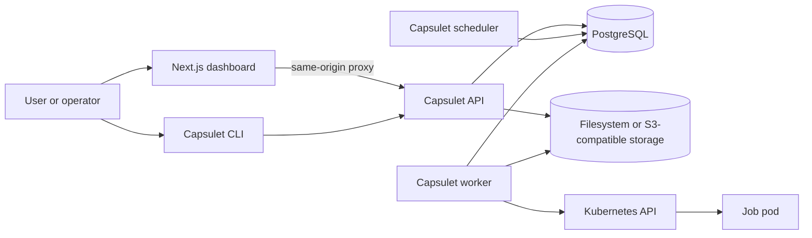
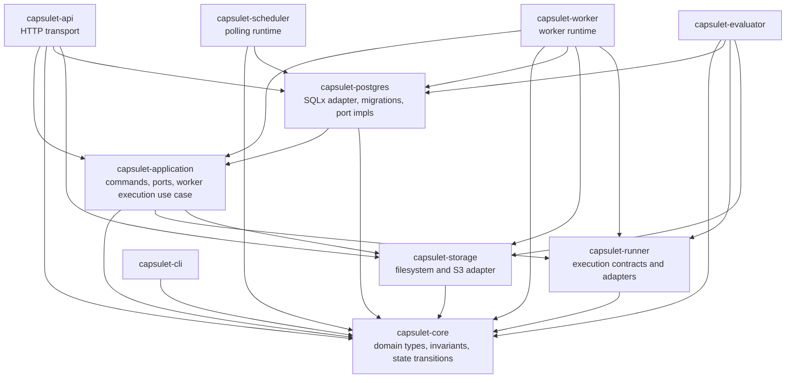
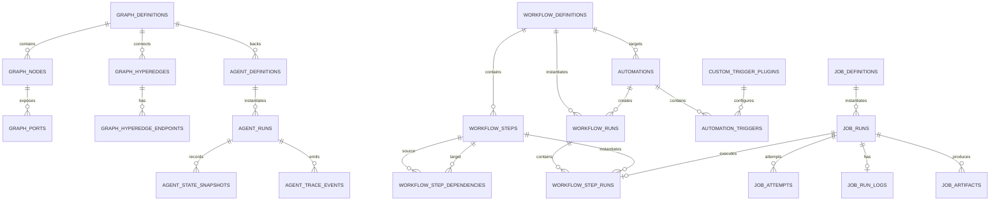
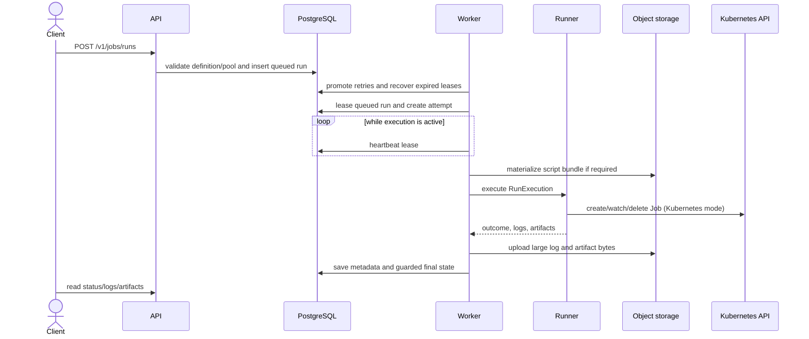
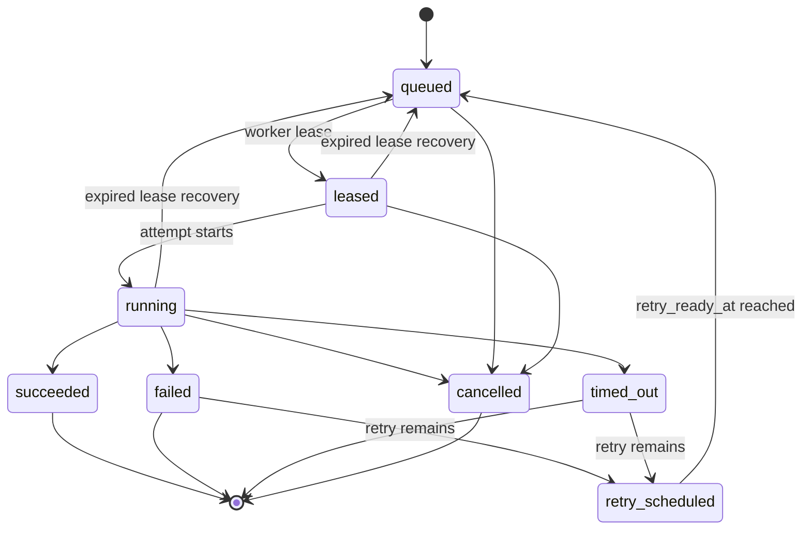
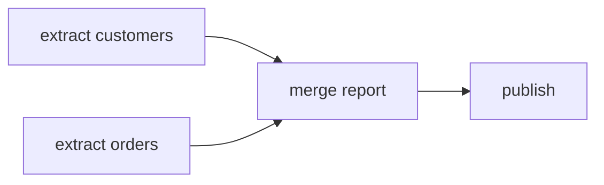

# Capsulet Architecture

This document describes the architecture implemented in this repository. Capsulet is becoming a local-first AI memory platform. The implemented foundation is a Kubernetes-native platform for defining typed agent execution graphs, binding them to bounded agent definitions, starting durable agent runs, and retaining state snapshots, trace events, logs, and artifacts. The upcoming memory graph layer will model claims, entities, events, evidence, permissions, trust, contradictions, and time. Python jobs and workflow DAGs remain as compatibility infrastructure and deterministic execution tools for agent systems.

For a shorter operator-facing overview, see [docs/architecture.md](docs/architecture.md). Architecture decisions are recorded under [docs/adr](docs/adr).

## Scope and maturity

The current system provides an authenticated PostgreSQL-backed control plane, typed execution-graph and agent persistence, an application-level agent runtime, a dashboard and CLI, filesystem or S3-compatible object storage, and stub, local-process, WASI Python, and Kubernetes Job execution backends.

PostgreSQL is the implemented durable event and coordination channel. Kafka remains an optional future scaling path. Hostile multi-tenant workloads should configure a sandboxed Kubernetes RuntimeClass such as gVisor or Kata in addition to the enforced pod security and default-deny network policy.

## System context

PostgreSQL is the source of truth for definitions and execution state. Object storage owns script bytes, full large logs, and artifact bytes. Kubernetes owns pod placement and resource enforcement when the worker uses the Kubernetes runner.

## Runtime components

### API (`capsulet-api`)

The Axum API is the synchronous control-plane boundary. It:

- runs embedded SQLx migrations on startup, unless migration behavior is configured separately;
- creates, lists, and reads typed agent execution graph definitions;
- creates, lists, and reads agent definitions and queued agent runs;
- creates, lists, reads, updates, and deletes job definitions;
- creates and reads compatibility workflow definitions, including dependency edges;
- manages automations, trigger definitions, and custom-trigger plugin metadata;
- creates manual job, workflow, and agent runs;
- exposes run filtering, logs, cancellation, workflow resume/removal, and artifact download;
- validates job input contracts, workflow graphs, trigger configuration, and condition trees;
- exposes `/livez`, `/readyz`, `/metrics`, and the compatibility alias `/healthz`.

The API is the HTTP transport adapter. Route wiring, middleware, request extraction, response models, and status-code mapping live in `capsulet-api`. Shared application commands and ports live in `capsulet-application`; some HTTP orchestration still lives in `capsulet-api` and is being moved behind application services incrementally. PostgreSQL and object storage remain concrete adapters through `capsulet-postgres` and `capsulet-storage`. Bearer authentication is fail-closed by default, viewer/operator/admin roles authorize routes, and mutation audits are durable.

### Agent runtime (`capsulet-application::agent_runtime`)

The first agent runtime slice lives in the application crate so it can be driven by the API, a future agent worker, or tests without depending on HTTP or SQLx. It:

- validates that the run belongs to the agent and is not terminal;
- marks queued runs running;
- walks the graph's static order;
- calls a pluggable `AgentNodeExecutor` for each node;
- persists every state version through an `AgentRuntimeRepository`;
- appends semantic trace events for node start/completion, budget stops, failures, and run success;
- enforces step, token, and cost budgets;
- maps validator-pass outcomes to `succeeded` and other explicit stops to `stopped`.

Provider-specific LLM, embedding, vector-search, reranking, prompt, memory, and validation adapters should implement the node executor boundary rather than entering the domain model. The runtime acts on agent execution graphs; it should later call into the memory graph through explicit memory query/write adapters rather than mixing claim governance into execution-graph primitives.

### Scheduler (`capsulet-scheduler`)

The scheduler is a PostgreSQL polling loop. Each tick:

1. creates workflow runs for due enabled legacy interval automations;
2. reconciles non-terminal workflow runs;
3. queues every DAG step whose prerequisites have succeeded;
4. marks workflow runs succeeded, failed, timed out, or cancelled when their graph reaches a terminal outcome.

The scheduler is currently a compatibility workflow component. Future automation work should create agent runs directly and use workflow DAGs only for deterministic tool jobs where they still fit.

It exposes health endpoints on a separate listener (default `0.0.0.0:8082`). `/livez` checks the process; `/readyz` and `/healthz` ping PostgreSQL.

### Worker (`capsulet-worker`)

The worker is the job-run runtime. Environment parsing, polling, runner selection, and health endpoints live in `capsulet-worker`; the lease-and-run use case lives in `capsulet-application::execution`. Before leasing work it promotes ready retries and recovers expired leases. It then leases the oldest queued run with `FOR UPDATE SKIP LOCKED`, creates an attempt, executes through a runner, persists logs and artifacts, and commits a guarded terminal or retry state.

For long-running work, a heartbeat task refreshes `heartbeat_at` and extends `lease_expires_at`. The worker health listener defaults to `0.0.0.0:8081`; readiness depends on PostgreSQL.

### Runner library (`capsulet-runner`)

The `Runner` contract accepts a `RunExecution` and returns a `RunReport`. The crate exposes focused modules for the contract, execution pools, and runner adapters. Implementations include:

- `StubRunner` returns deterministic success or failure for tests and Compose smoke flows.
- `ProcessRunner` executes a local process and is intended for trusted development use.
- `WasmPythonRunner` executes Python scripts through an operator-provided WASI Python runtime.
- `KubernetesRunner` builds a Kubernetes Job, applies execution-pool scheduling and resource settings, watches completion/cancellation/timeout, captures pod logs, and collects files from `/capsulet/artifacts`.

The `capsulet-runner` binary is only a component placeholder; execution is coordinated by the worker library.

### Dashboard (`dashboard`)

The Next.js dashboard currently provides authenticated authoring and operational views for job definitions, workflow DAGs, automations, execution pools/host groups, runs, logs, artifacts, identity, and audit events. The product direction is to add graph/agent authoring and agent-run trace views as the primary experience. Browser requests go through `/api/capsulet/...`; the server-side proxy reads an HttpOnly credential cookie and forwards its bearer token to `CAPSULET_DASHBOARD_API_URL`.

### CLI (`capsulet-cli`)

The CLI is an HTTP client for job submission, script submission, run listing/detail/status, logs, cancellation, and artifact list/download. It does not access PostgreSQL or object storage directly.

### Evaluator (`capsulet-evaluator`)

The evaluator continuously produces timezone-aware cron, read-only SQL, and isolated custom-plugin events, consumes signed-webhook events, evaluates durable correlation groups, and creates workflow runs exactly once. Leases, retry/dead-letter state, per-trigger runtime errors, health/metrics, and retention cleanup support multiple evaluator replicas.

## Workspace boundaries

`capsulet-core` is the pure domain crate. It owns typed IDs, validated value objects, execution graph and agent aggregate state, workflow compatibility state, trigger conditions, and domain errors. It intentionally does not own async repository traits, SQL rows, HTTP models, runner implementations, or process runtime logic. Memory graph primitives should be added here as separate claim/entity/evidence concepts rather than folded into `GraphDefinition`.

`capsulet-application` sits between the domain and adapters. It currently owns command/query shapes, application ports, the agent runtime use case, orchestration errors, and the worker lease-and-run use case. Ports include graph repositories, agent repositories, agent-runtime trace/state repositories, job-run repositories, log repositories, artifact repositories, and worker execution storage. Infrastructure crates implement these ports at their boundaries rather than exposing SQL rows, object-store details, or Kubernetes types to the domain.

## Domain and persistence model

The schema is defined by append-only migrations under `migrations/`. Definitions are durable resources; runs are snapshots/references to those resources. Foreign keys and explicit service transactions preserve ownership relationships.

Execution pools and host groups are configuration-derived views, not database-managed resources. Pool configuration is supplied by environment/Helm configuration and resolved by the worker at execution time.

## Job execution flow

Single-file Python definitions store `main.py` in object storage. At execution time the worker materializes the script and adjusts the command. Inline logs are bounded to 64 KiB; a larger complete log is uploaded as `logs/<run-id>/stdout.log`. Artifact bytes use `artifacts/<run-id>/<name>` and metadata remains in PostgreSQL.

### Job-run states

Transitions are represented by `JobRunTransition` and validated in the domain. Store updates use status/lease guards so a stale worker result cannot overwrite cancellation or another owner's state.

## Compatibility workflow DAG execution

The legacy workflow DAG model remains for deterministic jobs and Python tool pipelines. It is no longer the product's design center, but it is still a useful compatibility shape and execution substrate for agent tools. A workflow contains steps plus directed dependency edges. API validation rejects duplicate edges, self-edges, references to unknown steps, and cycles.

- If `dependencies` is omitted, the API creates a position-ordered chain for compatibility.
- If `dependencies` is an empty array, every step is an independent root.
- Otherwise, the submitted edges define the DAG and can express fan-out/fan-in.

The scheduler may queue multiple ready roots in one reconciliation. A node is ready only when all predecessors have successful step runs. A downstream failure stops that path and causes a terminal workflow result. Resume preserves successful checkpoints, removes unsuccessful step attempts, and queues only nodes whose prerequisites remain satisfied.

Before a dependent job starts, the worker loads artifacts from each successful direct prerequisite and stages them under `/capsulet/inputs/<producer-step-id>/<artifact-name>`. Artifact names that are unique across those prerequisites are also available at `/capsulet/inputs/<artifact-name>`. This gives notebook cells and Python SDK tasks a deterministic file handoff without coupling user code to object-storage credentials.

## Automations and triggers

The current automation implementation targets one compatibility workflow and stores enabled/disabled state, input JSON, legacy trigger settings, a set of named triggers, and a condition expression. Supported trigger-definition kinds are:

- `manual`
- `schedule`
- `sql`
- `custom` (references custom-trigger plugin metadata)

The API validates trigger names, kind-specific configuration, plugin references, input/config contracts, and condition references. It also retains compatibility fields for `manual` and fixed `interval` automations.

`POST /v1/automations/{id}/trigger` starts manual workflow runs directly. The evaluator produces cron, SQL, and custom-plugin events and consumes signed webhooks; durable correlation groups are evaluated into workflow runs exactly once. The scheduler retains legacy interval compatibility and advances workflow DAGs. The next automation direction is direct agent-run triggering with workflow creation kept as a compatibility path.

## Execution pools

Execution pools are static YAML configuration. A pool can define:

- node selector and tolerations;
- resource requests and limits;
- timeout seconds;
- Kubernetes Job TTL after completion;
- a documented maximum-concurrency value.

The API exposes configured pool and host-group views. The worker resolves the selected pool, applies it to a Kubernetes Job, and passes each pool's `maxConcurrentJobs` limit into the lease query so active leased work is capped per pool.

## Deployment views

### Docker Compose

`compose.yaml` starts PostgreSQL, MinIO and its bucket initializer, API, scheduler, worker, dashboard, and Mailpit. The Compose worker uses the stub runner, so it exercises control-plane behavior without launching user containers.

### Helm

The chart deploys API, scheduler, evaluator, worker, and dashboard. It also renders migration and bucket Jobs, separated RBAC/service accounts, health and metrics services, execution-pool configuration, default-deny execution networking, and optional bundled PostgreSQL and MinIO. External PostgreSQL and S3-compatible storage are supported and are the production-shaped dependency mode.

The worker service account can create, watch, and delete Kubernetes Jobs and inspect pods/logs in the execution namespace. Job pods use their own configured service-account/security settings.

## Reliability and health

- PostgreSQL is the durable queue; workers coordinate with row locks and leases.
- API admission can reject manual job submissions and manual workflow triggers before persistence when configured queue-depth caps are reached.
- Workers periodically heartbeat active runs and extend leases.
- Expired `leased` and `running` rows are requeued.
- API, scheduler, and worker expose liveness/readiness endpoints; readiness checks PostgreSQL.
- Compose and Helm configure restart policies/probes for long-running services.
- Retry policy is fixed delay per job definition; cancellation is terminal.

Recovery is at-least-once. Kubernetes Job names and labels encode the run and attempt; after lease expiry a replacement worker adopts the same attempt, validates the existing Job identity, and resumes watching it.

## Security boundaries

User-authored commands are untrusted relative to the control plane. The Kubernetes runner supplies process isolation, resource limits, security context, and scheduling constraints, but a Kubernetes Job is not a complete sandbox.

The chart defaults platform and execution containers toward non-root execution, dropped capabilities, disabled privilege escalation, read-only root filesystems, and `RuntimeDefault` seccomp. Execution Jobs also disable service-account token mounting, use a separate permissionless ServiceAccount, receive bounded writable volumes, and are selected by a default-deny egress policy. A sandboxed RuntimeClass can be configured per pool or globally. Optional Helm-managed `ValidatingAdmissionPolicy` resources enforce execution-pod security, digest-pinned runtime images, and pool-derived image allowlists at the Kubernetes API boundary.

The API requires configured bearer credentials unless authentication is explicitly disabled. The dashboard stores the credential in a same-origin HttpOnly cookie. Operators remain responsible for secret rotation, TLS ingress, trusted image policy, and cluster-level controls.

## Known gaps and intended evolution

- add an optional event-stream transport for deployments that outgrow PostgreSQL polling;
- add packaged SLO dashboards;
- add image-signature verification through a cluster policy engine such as Sigstore Policy Controller or Kyverno;
- support multi-file and versioned bundles.

These are extension paths beyond the implemented production baseline.
