# Capsulet Architecture

This document describes the planned architecture for Capsulet: a Kubernetes-native automation platform, job queue, and sandboxed script execution system distributed as a Helm chart.

Capsulet is currently in the planning stage. This architecture is the target shape for the first serious implementation, with later production-grade extensions called out where useful.

## Architecture Goals

- Install Capsulet as a complete Kubernetes application through Helm.
- Treat automations as the user-facing object for trigger-driven job creation.
- Run user jobs as isolated Kubernetes Jobs.
- Route jobs to named execution pools such as `mini`, `large`, or `gpu`.
- Persist job state, attempts, logs, artifacts, and audit events.
- Keep the system understandable enough to build incrementally.
- Use Kubernetes-native scheduling primitives instead of inventing a node scheduler.

## System Context

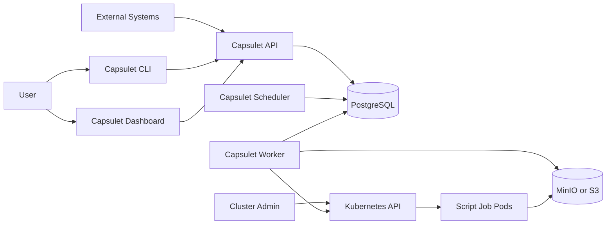

Capsulet owns automation evaluation, durable run state, retries, job attempts, logs, artifacts, and user-facing APIs. Kubernetes owns actual pod placement, resource enforcement, pod lifecycle, and node selection.

## Deployed Components

### `capsulet-api`

The API is the main control plane entry point.

Responsibilities:

- create and manage automations
- create and manage job definitions
- submit manual jobs
- receive webhook trigger events
- expose job status, attempts, logs, and artifacts
- validate user input
- enforce API authentication and authorization in later phases
- write durable records to PostgreSQL

### `capsulet-scheduler`

The scheduler evaluates time-based and delayed work.

Responsibilities:

- evaluate scheduled triggers
- evaluate delayed triggers
- create pending automation events
- ask the evaluator to evaluate automation conditions
- handle retry scheduling
- avoid duplicate scheduled runs through durable locks

The scheduler should not directly run user code. It creates durable work for workers to execute.

### `capsulet-evaluator`

The evaluator is the automation decision service. It receives trigger events, evaluates automation condition trees, and creates durable job or workflow runs when conditions are satisfied.

Responsibilities:

- evaluate automation condition trees
- enforce trigger event idempotency
- create job or workflow runs when automations fire
- record automation fire events for auditability
- keep automation evaluation separate from HTTP request handling and scheduled trigger scanning

In early development, this can start as a module used by the API and scheduler. The target architecture is a separate service so automation evaluation can scale and fail independently.

### `capsulet-worker`

The worker executes durable job runs by creating Kubernetes Jobs.

Responsibilities:

- lease queued job runs
- resolve the execution pool
- render Kubernetes Job specs
- create Kubernetes Jobs through the Kubernetes API
- watch pod and job status
- collect logs
- upload artifacts to object storage
- update job run and attempt state
- recover work after worker restarts

### `capsulet-dashboard`

The dashboard is the browser UI.

Responsibilities:

- automation builder
- trigger condition builder
- execution pool selector
- job and workflow run list
- job detail view
- log and artifact views
- basic operational visibility

### `capsulet-cli`

The CLI is the local operator and developer interface.

Responsibilities:

- submit jobs
- create or import automations
- inspect status
- stream or fetch logs
- cancel runs
- inspect configured execution pools

### PostgreSQL

PostgreSQL is the durable metadata store.

Stores:

- automations
- triggers
- trigger events
- job definitions
- workflow definitions
- job runs
- attempts
- leases
- retry schedules
- artifact metadata
- audit events

### Object Storage

Object storage holds larger data that does not belong directly in PostgreSQL.

Stores:

- artifacts
- large logs
- script bundles
- input payloads
- output payloads

The local Helm install can bundle MinIO. Production installs should support external S3-compatible storage.

Script bundles and log chunks should be stored in object storage, not PostgreSQL. PostgreSQL should store metadata, indexes, status, and storage references.

## Logical Data Model

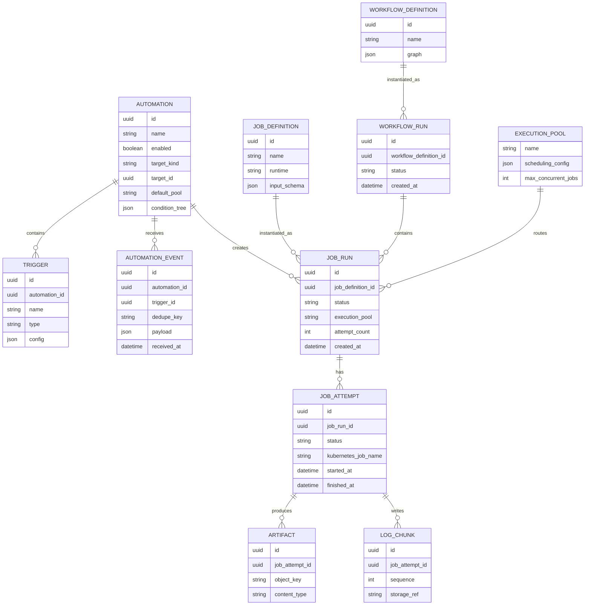

Execution pools may start as static Helm configuration rather than database rows. The logical model still treats them as addressable routing targets so the rest of the system has a stable concept.

## Core Concepts

### Automation

An automation is a named rule that decides when to create a job or workflow run.

An automation contains:

- name
- enabled or disabled state
- target job or workflow
- default execution pool
- trigger definitions
- boolean condition tree
- optional input mapping

Example:

```yaml
name: train-model-after-data-refresh
enabled: true
target:
  kind: workflow
  name: train-model
execution:
  pool: large
triggers:
  data_ready:
    type: dependency
  approved:
    type: webhook
  manual_override:
    type: manual
condition:
  or:
    - and:
        - trigger: data_ready
        - trigger: approved
    - trigger: manual_override
```

### Trigger

A trigger is one possible signal that can contribute to an automation firing.

Planned trigger types:

- `manual`
- `schedule`
- `delay`
- `webhook`
- `dependency`
- later `event`
- later `custom`

### Condition Tree

Trigger logic should be stored as a structured expression tree, not raw text.

Example:

```yaml
condition:
  or:
    - and:
        - trigger: data_ready
        - trigger: approved
    - trigger: manual_override
```

The UI can render this as grouped conditions with open and close brackets. The backend should validate a structured tree so it can reject invalid expressions before saving the automation.

### Execution Pool

An execution pool is a named compute target such as `mini`, `large`, or `gpu`.

Pools map to Kubernetes scheduling controls:

- `nodeSelector`
- affinity
- tolerations
- resource requests and limits
- default timeout
- concurrency limit
- optional namespace

Capsulet chooses the pool. Kubernetes chooses the actual node inside that pool.

## Component Architecture

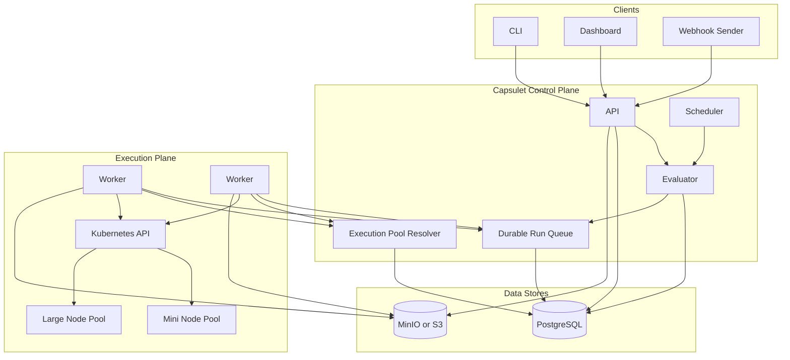

In the first implementation, `Evaluator`, `Durable Run Queue`, and `Execution Pool Resolver` can be modules inside the API, scheduler, worker, or shared core crate. The target production architecture promotes the evaluator into its own service.

## Helm Deployment View

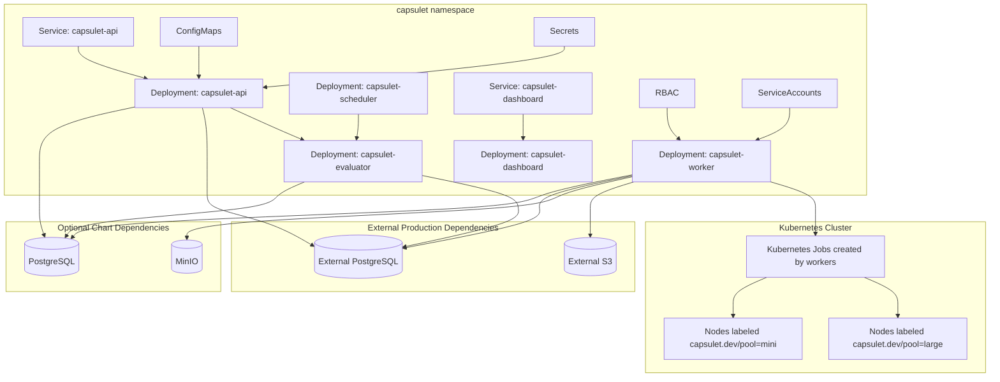

The Helm chart should support bundled PostgreSQL and MinIO for local evaluation, while also supporting external dependencies for production-shaped installs.

## Sequence: Manual Job Submission

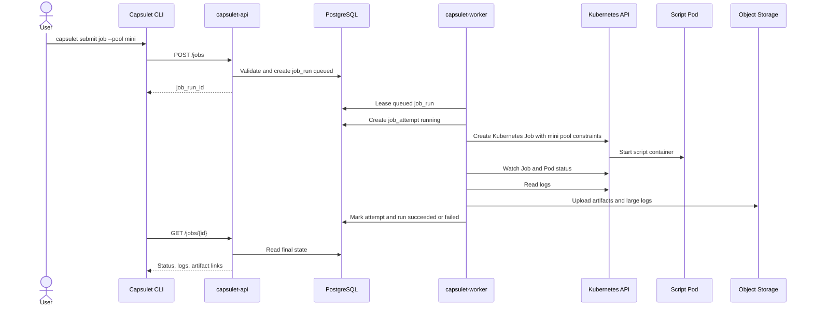

## Sequence: Scheduled Automation

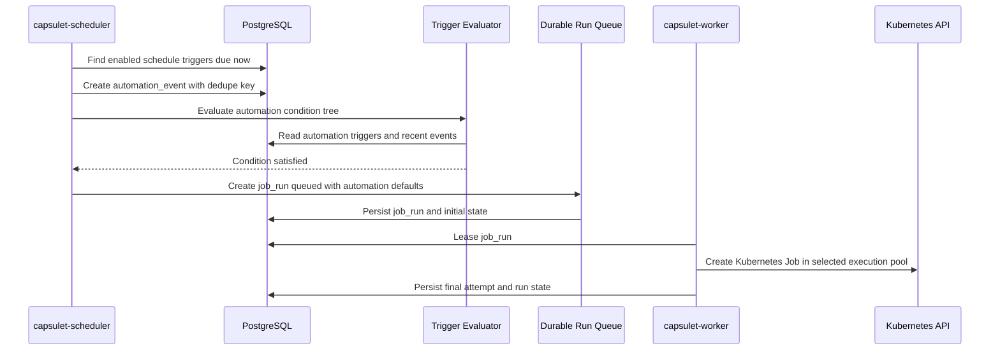

The scheduler must use dedupe keys and transactional writes so the same cron tick does not create duplicate runs after restarts.

## Sequence: Webhook Automation

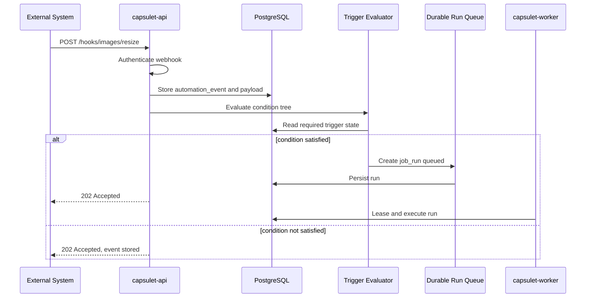

Webhook triggers need idempotency, authentication, rate limiting, and audit events before they should be considered production-ready.

## Sequence: Dependency Trigger

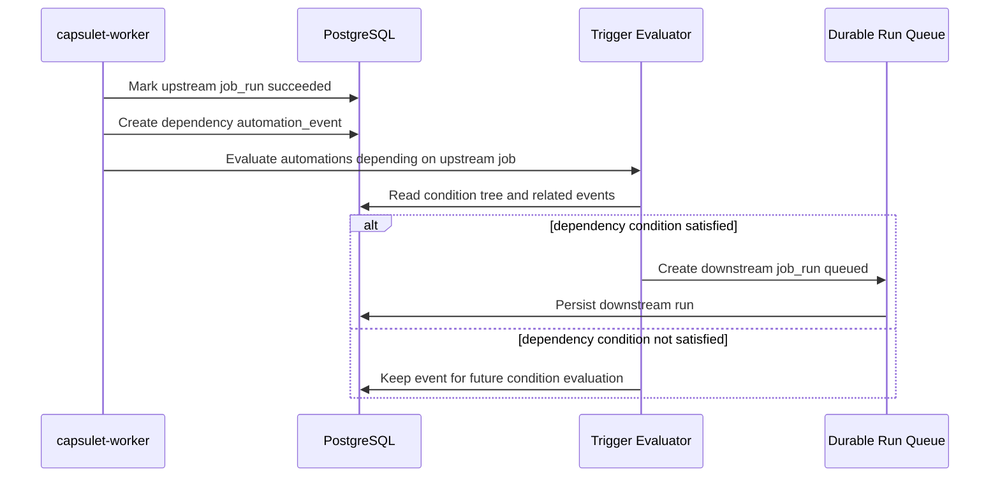

Dependency triggers are useful for workflows, but they must be idempotent. Retried attempts should not accidentally create duplicate downstream runs.

## Sequence: Execution Pool Routing

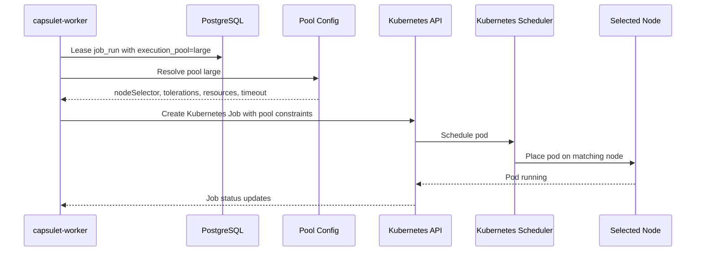

Capsulet should not round-robin directly across Kubernetes nodes. Kubernetes already has a scheduler for that. Capsulet should route to pools and let Kubernetes choose the specific node.

## Job State Machine

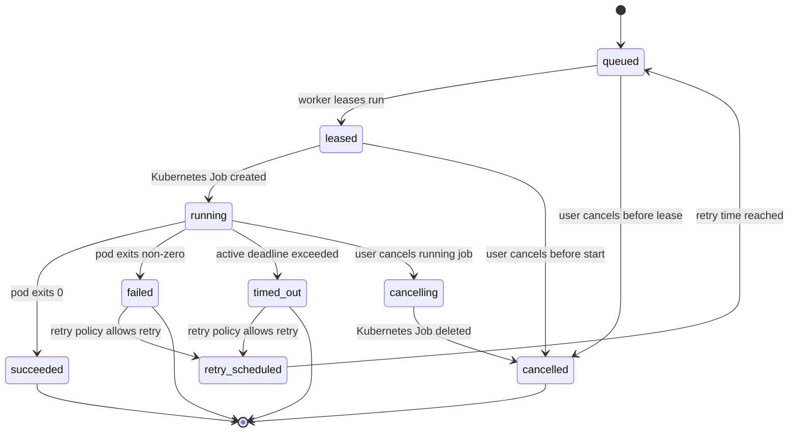

The state machine should be enforced by explicit transition rules. Workers must use compare-and-set style updates or transactional guards so two workers cannot own the same run.

## Automation Evaluation Model

Automation evaluation should be event-driven and durable.

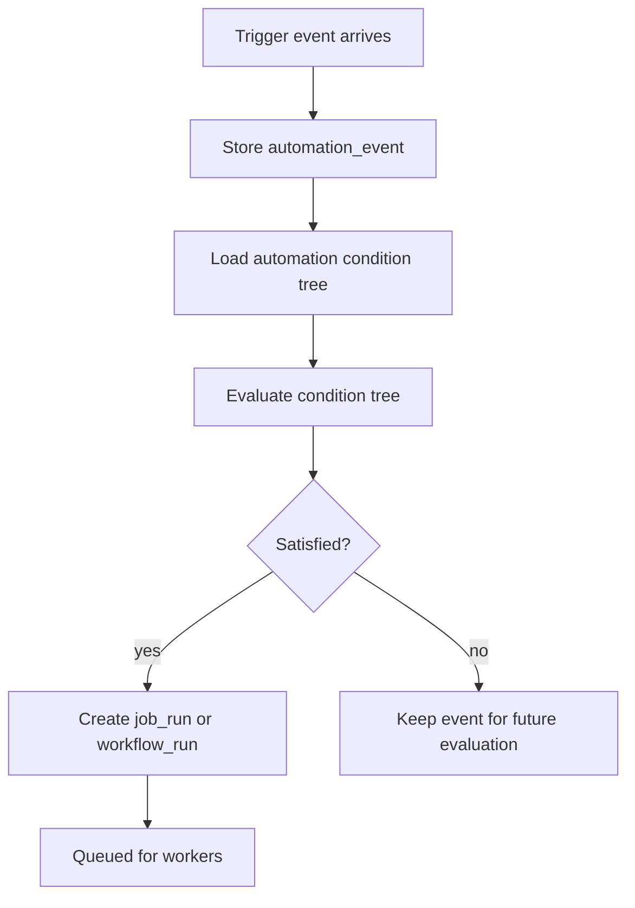

Rules:

- every trigger event should have a dedupe key
- evaluation should be repeatable after process restart
- condition trees should be validated before saving
- automation firing should create at most one run for a logical event set
- disabled automations should not create new runs
- every fired automation should produce an audit event

## Execution Pool Configuration

Example Helm values:

```yaml
executionPools:
  defaultPool: mini
  pools:
    mini:
      nodeSelector:
        capsulet.dev/pool: mini
      resources:
        requests:
          cpu: 100m
          memory: 128Mi
        limits:
          cpu: 500m
          memory: 512Mi
      timeoutSeconds: 120
      maxConcurrentJobs: 50

    large:
      nodeSelector:
        capsulet.dev/pool: large
      tolerations:
        - key: capsulet.dev/pool
          operator: Equal
          value: large
          effect: NoSchedule
      resources:
        requests:
          cpu: "2"
          memory: 4Gi
        limits:
          cpu: "8"
          memory: 16Gi
      timeoutSeconds: 3600
      maxConcurrentJobs: 10
```

First implementation:

- pools can start as static Helm configuration
- job runs store the selected pool name
- workers resolve pool configuration at execution time
- pool configuration is mounted into workers as ConfigMap data

Later implementation:

- pools should become API-managed objects
- Helm values should still support bootstrapping initial pools during install
- runtime pool changes can be audited
- pool health and capacity can be surfaced in the dashboard

## Security Boundaries

Capsulet runs user-provided code, so the execution boundary matters.

Recommended baseline:

- script jobs run in a dedicated namespace or pool-specific namespace
- script jobs use a separate service account from platform components
- script job service accounts have minimal or no Kubernetes permissions
- containers run as non-root
- privilege escalation is disabled
- Linux capabilities are dropped
- seccomp uses `RuntimeDefault`
- resources and timeouts are required
- network policy is available and should default toward restricted egress
- secret access is explicit and auditable

Trust boundaries:

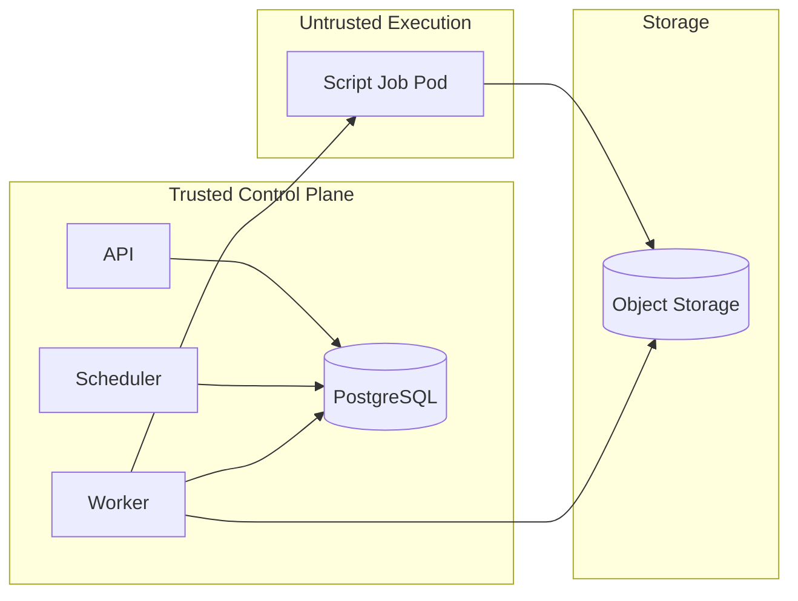

Capsulet should document that Kubernetes Jobs are isolation, not a perfect sandbox. Serious untrusted execution should use dedicated namespaces, strict network policies, restricted runtime images, resource limits, and preferably dedicated clusters for high-risk workloads.

## Observability

Required signals:

- API request counts, latency, and error rates
- queue depth
- run counts by state
- attempt counts by state
- worker lease counts
- worker lease expiry counts
- job duration by execution pool
- Kubernetes Job creation failures
- artifact upload failures
- trigger events by type
- automation fires by automation and trigger type
- webhook authentication failures

Logs should be structured and include stable IDs:

- `automation_id`
- `trigger_id`
- `job_run_id`
- `job_attempt_id`
- `execution_pool`
- `kubernetes_job_name`

## Failure Handling

Expected failure cases:

- API restarts during submission
- scheduler restarts during cron evaluation
- worker crashes after leasing a run
- Kubernetes Job is created but worker misses events
- script pod is evicted
- object storage upload fails
- database migration fails
- external webhook retries the same event

Required design responses:

- transactional state transitions
- lease expiry and recovery
- idempotency keys for trigger events
- reconciliation for orphaned Kubernetes Jobs
- retry policies for transient errors
- clear terminal states for user-code failures
- audit events for cancellation and administrative changes

## Initial Implementation Slices

The architecture should be built in slices rather than all at once.

### Slice 1: Manual Job Runner

- API creates a queued job run
- worker leases it
- worker creates a Kubernetes Job
- script bundles, logs, and artifacts are stored in object storage
- final state and storage references are recorded in PostgreSQL
- CLI can submit and inspect the run

### Slice 2: Helm Install

- API, worker, scheduler, evaluator, and dashboard deployments
- PostgreSQL and MinIO local dependencies
- RBAC and service accounts
- configurable images
- basic security context

### Slice 3: Execution Pools

- static Helm values for pools
- pool selected at submission time
- worker applies pool scheduling constraints
- pool-level resources and timeout
- later API-managed pool lifecycle

### Slice 4: Automations

- automation model
- manual trigger
- scheduled trigger
- simple condition tree
- dashboard automation builder
- YAML import and export

### Slice 5: Advanced Triggers

- workflow definitions
- workflow lineage
- webhook triggers
- dependency triggers
- HMAC-signed webhook authentication
- idempotency
- audit events
- grouped boolean expressions

## Architecture Decisions

### Authoring Model

Automations and job definitions should support both UI authoring and YAML authoring.

The UI should be the primary beginner-friendly workflow. YAML should support import, export, review, version control, and GitOps-style usage. The API should treat both paths as ways to create the same durable domain objects.

YAML resources should be versioned and kind-based:

```yaml
apiVersion: capsulet.dev/v1alpha1
kind: JobDefinition
metadata:
  name: send-email
spec:
  runtime:
    image: python:3.12-slim
    command: ["python", "/workspace/main.py"]
  bundle:
    source: ./jobs/send-email
  inputSchema:
    type: object
    required: ["to", "subject"]
```

```yaml
apiVersion: capsulet.dev/v1alpha1
kind: Automation
metadata:
  name: nightly-report
spec:
  enabled: true
  target:
    kind: JobDefinition
    name: generate-report
  execution:
    pool: mini
  triggers:
    nightly:
      type: schedule
      cron: "0 2 * * *"
      timezone: UTC
  condition:
    trigger: nightly
```

The schema should start at `v1alpha1` so the project can evolve field names before a stable release.

YAML import and export should be handled by the API and CLI for now. The dashboard should focus on structured forms and visual builders rather than raw YAML editing in the first versions.

### Execution Pool Management

Execution pools should support both Helm bootstrapping and API management.

Initial releases can define pools statically through Helm values because that is simple and operationally clear. Later releases should add API-managed pools so operators can create, update, disable, and audit pools without a Helm upgrade.

API-managed execution pools should be added after the initial Helm-defined pool implementation is stable. The first pool implementation should prove scheduling, resource defaults, timeouts, and worker behavior before adding runtime mutation.

### Script and Log Storage

Script bundles should be stored in object storage for all jobs.

Log chunks should also be stored in object storage.

PostgreSQL should store metadata and references:

- script bundle object keys
- log object keys
- artifact object keys
- checksums
- content type
- size
- retention metadata
- job and attempt status

This avoids turning PostgreSQL into a blob store and keeps the architecture consistent for small and large jobs.

### Automation Evaluation

Automation condition evaluation should move to a separate `capsulet-evaluator` service.

Early versions may implement the evaluator as a shared module, but the target deployment should have a separate evaluator component. This keeps HTTP request handling, scheduled trigger scanning, and automation decision-making decoupled.

The evaluator should communicate through an event channel instead of PostgreSQL polling as the target design. Kafka is the preferred default event channel for production-shaped deployments because it gives durable topics, consumer groups, replay, ordering within partitions, and a familiar operational model for event-driven systems.

PostgreSQL remains the durable source of truth for Capsulet domain state. Kafka carries trigger events, automation evaluation requests, run-created events, and lifecycle notifications. Consumers must still write idempotently to PostgreSQL so replayed events do not create duplicate job runs.

For local evaluation, the Helm chart can eventually offer a bundled single-node Kafka-compatible profile. Early development may still use an in-process channel or database-backed fallback until the evaluator and event contracts stabilize.

### Webhook Authentication

The minimum useful webhook authentication model should be HMAC-signed shared secrets.

Baseline webhook requirements:

- each webhook trigger has its own secret
- senders include a timestamp header
- senders include a signature header
- Capsulet verifies the HMAC over the timestamp and request body
- Capsulet rejects stale timestamps to reduce replay risk
- Capsulet stores a dedupe key for idempotency

Plain bearer tokens are simpler, but HMAC signatures are a better default because they protect request integrity as well as possession of the secret.

### Workflow and Dependency Ordering

Workflow definitions should come before dependency triggers.

Dependency triggers need a clear lineage model: which job or workflow produced an event, which run consumed it, and which downstream run was created. Implementing workflow definitions first gives dependency triggers a stable graph and run history to attach to.

Workflow lineage should be exposed as a graph in the first workflow release. The API can also expose a parent-child list for simpler clients, but the domain model should preserve graph edges from the beginning.

### Dashboard Default

The dashboard should be enabled by default in the Helm chart, but optional.

Default install should include enough dashboard functionality to evaluate the product:

- job list
- job detail
- logs and artifacts
- automation list
- simple automation builder
- execution pool visibility

Production users should be able to disable it:

```sh
helm upgrade capsulet capsulet/capsulet \
  --namespace capsulet \
  --set dashboard.enabled=false
```

### Retention Defaults

Retention should follow conservative self-hosted defaults: useful for evaluation, bounded enough to avoid unintentional storage growth, and configurable through Helm and API settings.

Recommended defaults:

- successful job logs: 14 days
- failed job logs: 30 days
- script bundles: 30 days after the last associated run is deleted or expired
- artifacts: 30 days
- job and attempt metadata: 90 days
- audit events: 180 days
- manual retention override: supported per job definition in later releases

Retention cleanup should delete object storage data and then remove or mark PostgreSQL metadata. Cleanup should be idempotent so interrupted cleanup runs can resume safely.

Retention overrides should start at the job definition level. That is the cleanest default because retention usually depends on the kind of work and data produced, not the trigger that started it. Automation-level retention overrides can be added later if real use cases need the same job definition to retain outputs differently depending on how it was triggered.

## Remaining Open Architecture Questions

No major architecture questions are currently open. Future implementation work should create focused design notes for event schemas, YAML validation, database migrations, and Helm values before coding those areas.
