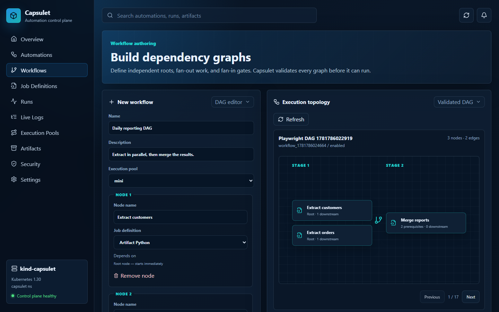

# Capsulet

Capsulet is a Kubernetes-native automation control plane for durable, script-centric workflows. It combines reusable job definitions, dependency-graph workflows, authenticated automation triggers, isolated execution, logs, artifacts, retry policies, and operational health checks behind one API, CLI, and dashboard.



## What works today

- reusable Python job definitions with JSON input schemas and retry policies
- validated workflow DAGs with parallel roots, fan-out, and fan-in dependencies
- manual, timezone-aware cron, read-only SQL, signed webhook, and isolated custom-plugin triggers
- bearer authentication with viewer/operator/admin authorization and durable mutation auditing
- durable PostgreSQL job, attempt, workflow-step, log, and artifact metadata
- stub, trusted local process, WASI Python, and Kubernetes Job runners
- S3-compatible or filesystem artifact storage
- enforced execution-pool concurrency, cancellation, timeouts, delayed retry, and stale-lease recovery
- owner-bound worker heartbeats that prevent stale workers from finalizing reassigned work
- workflow resume from successful step checkpoints after failure or timeout
- Kubernetes Job reattachment after worker failure
- API, worker, scheduler, and evaluator health and Prometheus metrics endpoints
- configurable artifact, log, trigger-event, and audit retention cleanup
- Docker Compose for local use and a Helm chart for Kubernetes

## How execution stays durable

PostgreSQL is the source of truth. A worker atomically leases a queued job, records the attempt, and renews the lease while execution is active. If the worker disappears, the expired lease is requeued. Lease ownership is checked during heartbeat and finalization, so an old worker cannot overwrite a newer attempt.

Every workflow node has a durable step run. Successful nodes are checkpoints: their metadata and artifacts remain complete even when another branch fails. Calling the resume endpoint removes only unsuccessful attempts and lets the scheduler reconstruct the missing runnable nodes from the saved graph state.

```text
automation -> workflow run -> ready DAG nodes -> job runs -> runner
                    ^              |               |
                    |              v               v
                    +---- persisted checkpoints, logs, and artifacts
```

## Local Docker Compose

Prerequisites: Docker with Compose v2.

```sh
docker compose up --build -d
docker compose ps
```

Open the dashboard at <http://127.0.0.1:3000> and the API at <http://127.0.0.1:8080>.

The local stack includes PostgreSQL, MinIO, Mailpit, API, worker, scheduler, evaluator, and dashboard. Compose waits on dependency health and restarts long-running services after failure. Sign in with the development token `capsulet-local-admin-token-change-me`; replace it before exposing the stack.

Useful checks:

```sh
curl http://127.0.0.1:8080/livez
curl http://127.0.0.1:8080/readyz
curl http://127.0.0.1:8080/metrics
docker compose logs -f api worker scheduler evaluator
```

Stop the stack without deleting persisted volumes:

```sh
docker compose down
```

## Workflow recovery API

Resume a failed or timed-out workflow run:

```sh
curl -H 'Authorization: Bearer <token>' -X POST http://127.0.0.1:8080/v1/workflow-runs/<run-id>/resume
```

The response contains the workflow run and preserved successful step runs. Active, queued, cancelled, removed, and successful runs are rejected to avoid ambiguous recovery.

## Kubernetes with Helm

The chart installs the API, worker, scheduler, evaluator, dashboard, migration job, separated control-plane/execution service accounts, default-deny execution network policy, services, configuration, and optional bundled PostgreSQL and MinIO.

```sh
helm lint charts/capsulet
kubectl create namespace capsulet
kubectl create secret generic capsulet-api-auth \
  --namespace capsulet \
  --from-literal='tokens=[{"name":"cluster-admin","role":"admin","token":"replace-with-at-least-32-random-characters"}]'
helm install capsulet charts/capsulet \
  --namespace capsulet \
  --set api.auth.existingSecret=capsulet-api-auth

kubectl wait --for=condition=available deployment \
  --all --namespace capsulet --timeout=5m
kubectl port-forward service/capsulet-dashboard 3000:80 --namespace capsulet
```

Production deployments should use external managed PostgreSQL and object storage, immutable image tags, network policies, and dedicated execution capacity. Capsulet constrains execution pods but does not claim to be a complete sandbox for hostile code.

See [installation](docs/installation.md), [Helm values](docs/helm-values.md), and [worker/runner design](docs/worker-runner.md) for configuration details.

## Repository layout

```text
crates/
  application/  application services, use cases, and ports
  api/          HTTP control plane
  core/         domain types, state machines, and validation rules
  postgres/     SQLx persistence and migrations
  runner/       runner contracts plus stub, process, WASI, and Kubernetes adapters
  scheduler/    automation triggering and DAG reconciliation
  evaluator/    durable trigger evaluation and retention cleanup
  worker/       worker runtime loop, runner selection, and health endpoints
  storage/      filesystem and S3-compatible object storage
  cli/          command-line client
dashboard/      Next.js dashboard
sdk/python/     decorator-based Python workflow SDK
charts/capsulet Helm chart
migrations/     PostgreSQL schema history
```

## Development and verification

### Python workflow authoring

Workflows can be authored as decorated Python functions or as Python cells in the dashboard notebook. The [CSV artifact pipeline](examples/workflows/csv_pipeline.py) creates a CSV in one task, passes it to a dependent task, and downloads the transformed artifact. See the [example instructions](examples/workflows/README.md) for the end-to-end commands.

Rust is pinned to version 1.96.0. The dashboard requires Node.js 20 or newer.

```sh
cargo fmt --all -- --check
cargo clippy --workspace --all-targets --all-features --locked -- -D warnings
cargo test --workspace --all-targets --locked

cd dashboard
npm ci
npm test
npm run build
npm run test:e2e
```

Database integration tests run when `CAPSULET_TEST_DATABASE_URL` is set. Full local and Kubernetes validation steps are documented in [development](docs/development.md).

## Documentation

- [Architecture](ARCHITECTURE.md)
- [API](docs/api.md)
- [Development](docs/development.md)
- [Installation](docs/installation.md)
- [Persistence](docs/persistence.md)

## License

Apache-2.0. See [LICENSE](LICENSE).
