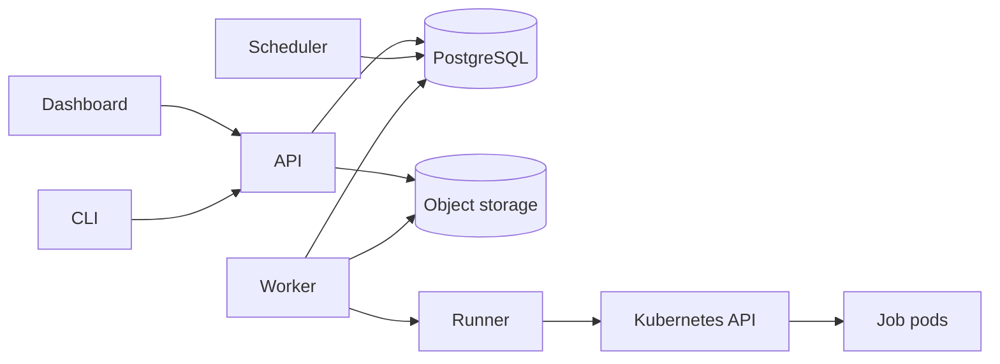

# Architecture Overview

Capsulet stores durable agent execution-graph control-plane state in PostgreSQL and executes graph nodes through pluggable runtime adapters. This is the foundation for the larger memory platform: the later memory graph will model claims, entities, events, evidence, permissions, trust, and time. The existing job runner stack remains as the deterministic tool/workflow substrate: the Kubernetes runner creates isolated Kubernetes Jobs, while local process and deterministic stub runners support development and tests.

The detailed system design and implementation boundaries are in the repository-level [ARCHITECTURE.md](../ARCHITECTURE.md).

## Components

- **API:** Axum HTTP control plane for typed agent execution graphs, agents, agent runs, job definitions, compatibility workflow DAGs, automations and trigger metadata, health, logs, cancellation, and artifacts.
- **Application runtime:** agent-run executor that walks graph order, calls node adapters, persists state snapshots, emits trace events, and enforces budgets and termination policies.
- **Scheduler:** PostgreSQL polling loop that fires due legacy interval automations and advances every ready node in compatibility workflow DAGs.
- **Worker:** lower-level job runtime that promotes retries, recovers expired leases, leases queued jobs, heartbeats active work, invokes a runner, and persists outcomes.
- **Runner library:** stub, trusted local-process, and Kubernetes Job execution backends.
- **PostgreSQL adapter:** SQLx persistence for graph definitions, graph nodes/ports/hyperedges, agent definitions, agent runs, state snapshots, trace events, job definitions/runs, attempts, leases/heartbeats, workflow dependency edges, automation metadata, logs, and artifact metadata.
- **Object storage adapter:** filesystem or S3-compatible storage for Python scripts, complete large logs, and artifact bytes.
- **Dashboard:** Next.js UI that reaches the API through a same-origin server proxy.
- **CLI:** HTTP client for submission and job-run operations.
- **Evaluator:** durable cron, SQL, webhook, and isolated custom-plugin trigger production and condition evaluation.

## Dependency view

PostgreSQL is the source of truth for metadata and state transitions. It is also the durable work queue. Object storage is not authoritative for run state; it contains bytes referenced by PostgreSQL metadata.

## Agent execution graph lifecycle

1. The API stores a validated typed execution graph: nodes, ports, hyperedges, transition policy, and static order.
2. The API stores an agent definition that references the graph and declares budget and termination policies.
3. Starting an agent run creates a queued run with an initial JSON state document.
4. The application runtime marks the run running, executes graph nodes through a node-adapter trait, and writes a new state snapshot after each completed node.
5. Every node start, completion, stop, budget exhaustion, and failure emits a run-local trace event.
6. The run exits as `succeeded`, `failed`, or `stopped` based on executor outcome, validator pass, or budget/termination policy.

The first runtime slice executes the graph's static order. The model is intentionally typed and stateful so later planner/cyclic execution can reuse the same graph, state, trace, and budget contracts. The memory graph is separate: it will provide governed claims and evidence that execution nodes can query and update through adapters.

## Job lifecycle

1. The API validates a job definition, input contract, and execution pool, then inserts a `queued` run.
2. A worker promotes due retries, recovers expired leases, and leases the oldest queued run with row locking.
3. The worker creates an attempt and heartbeats the run while its runner is active.
4. The runner returns a terminal outcome, logs, and collected artifacts.
5. The worker stores an inline log preview, offloads complete large logs and artifacts to object storage, and commits a guarded final state.
6. Failed or timed-out runs may enter `retry_scheduled`; cancellation is terminal.

Lease recovery provides at-least-once execution. Deterministic attempt-scoped Kubernetes Job identity lets a replacement worker validate and reattach to existing work without incrementing the attempt.

## Compatibility workflow lifecycle

Workflows are DAGs. Dependency edges can express fan-out and fan-in; the API rejects cycles and invalid edges. Omitting the dependency field creates a position-ordered compatibility chain, while an explicit empty list creates independent roots.

An automation or manual action creates a workflow run. On each tick, the scheduler queues every step whose predecessors have succeeded. It reconciles step outcomes into the workflow result. Resume keeps successful checkpoints and retries only the unfinished part of the graph.

## Automations

The compatibility authoring model supports named `manual`, `schedule`, `sql`, `webhook`, and `custom` trigger definitions, custom-trigger plugin metadata, and validated boolean condition expressions. Trigger events, leases, correlation, retries, and exactly-once workflow-run creation are durable in PostgreSQL. Future trigger slices should target agent runs directly instead of creating workflow runs first.

## Storage keys

- job-definition scripts: `bundles/job-definitions/<job-definition-id>/main.py`
- submitted run scripts: `bundles/<run-id>/main.py`
- complete large logs: `logs/<run-id>/stdout.log`
- artifacts: `artifacts/<run-id>/<name>`

Logs up to 64 KiB are stored inline. Larger logs keep a bounded inline preview and an object-backed `stdout.log` artifact.

## Deployment

Docker Compose supplies PostgreSQL, MinIO, API, scheduler, evaluator, a stub-runner worker, dashboard, and Mailpit for local evaluation. The Helm chart deploys the platform services, migration/bucket initialization jobs, separated service accounts, health/metrics, static execution pools, default-deny execution networking, and optional bundled PostgreSQL/MinIO. External PostgreSQL and S3-compatible storage are the production-shaped dependency mode.

API, scheduler, evaluator, and worker expose `/livez`, `/readyz`, and `/metrics`. Readiness depends on PostgreSQL connectivity.

## Security boundary

Execution pods run non-root with a read-only root filesystem, dropped capabilities, RuntimeDefault seccomp, no service-account token, bounded writable volumes, and default-deny egress. A separate unprivileged execution ServiceAccount and optional RuntimeClass are supported. Operators running hostile multi-tenant code should configure gVisor, Kata, or another sandboxed runtime; ordinary Linux containers are not a virtual-machine boundary.
