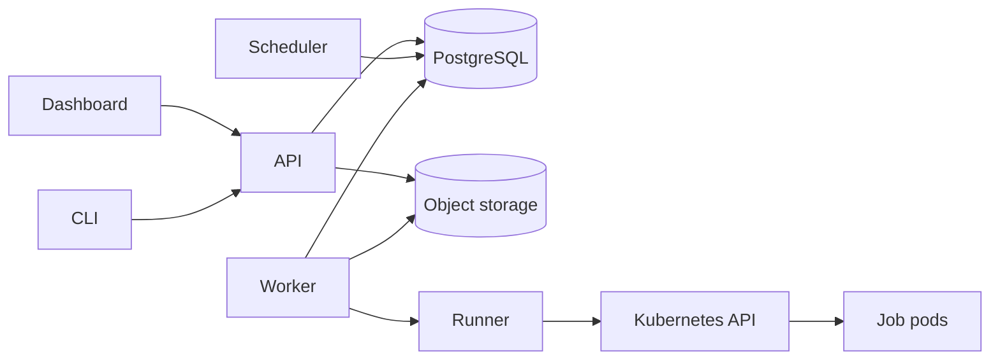

<!-- capsulet-claims: CAP-PRODUCT-001, CAP-CORRECTNESS-001, CAP-CORRECTNESS-002, CAP-CORRECTNESS-003, CAP-CORRECTNESS-004, CAP-CORRECTNESS-005, CAP-CORRECTNESS-006, CAP-CORRECTNESS-007, CAP-CORRECTNESS-008, CAP-GRAPH-001, CAP-AGENT-001, CAP-AGENT-002, CAP-MEMORY-001, CAP-JOB-001, CAP-WORKFLOW-001, CAP-AUTOMATION-001, CAP-IAM-001, CAP-LIFECYCLE-001, CAP-IR-001, CAP-IR-002, CAP-IR-003, CAP-IR-004, CAP-IR-006, CAP-ASSURANCE-001, CAP-ASSURANCE-002, CAP-ASSURANCE-003, CAP-ASSURANCE-004, CAP-ASSURANCE-005, CAP-ASSURANCE-006, CAP-REPLAY-001, CAP-REPLAY-002, CAP-REPLAY-003, CAP-ADAPTERS-001, CAP-RUNTIME-001, CAP-RUNTIME-002, CAP-RUNTIME-003, CAP-RUNTIME-004, CAP-RUNTIME-005, CAP-RUNTIME-006, CAP-RUNTIME-007, CAP-RUNTIME-008 -->
# Architecture Overview

Capsulet is a correctness-first AI-agent workflow platform with three layers. The implemented
workflow engine runs durable jobs and compatibility DAGs. The experimental agent platform stores
typed static graphs, agent definitions, traces, budgets, and governed memory. The correctness plane
has an implemented deterministic kernel/certificate slice, while runtime-wide assurance,
admission-controlled effects, and the unified IR remain planned.

Governed memory is a major subsystem for sources, evidence, entities, claims, relationships,
contracts, nested contexts, review queues, and conflicts; it is not the complete product identity.

Execution state and assurance verdict are separate. Current successful run states never imply an
`accepted` verdict; missing correctness-plane execution is `unverified`. See the
[lifecycle and assurance contract](contracts/lifecycle-and-assurance.md) for the enum inventory and
lossy mappings to the target lifecycle.

The detailed system design and implementation boundaries are in the repository-level [ARCHITECTURE.md](../ARCHITECTURE.md).

## Components

- **API:** Axum HTTP control plane for memory graph records, ingestion review, entity resolution, claim conflicts, typed agent execution graphs, agents, agent runs, job definitions, compatibility workflow DAGs, automations and trigger metadata, health, logs, cancellation, and artifacts.
- **Application runtime:** agent-run executor that walks graph order, calls node adapters, persists state snapshots, emits trace events, and enforces budgets and termination policies.
- **Scheduler:** PostgreSQL polling loop that fires due legacy interval automations and advances every ready node in compatibility workflow DAGs.
- **Worker:** lower-level job runtime that promotes retries, recovers expired leases, leases queued jobs, heartbeats active work, invokes a runner, and persists outcomes.
- **Runner library:** stub, trusted local-process, and Kubernetes Job execution backends.
- **PostgreSQL adapter:** SQLx persistence for memory sources/evidence/entities/claims/events/relationships/contracts/subgraphs/canonical identity/review state, graph definitions, graph nodes/ports/hyperedges, agent definitions, agent runs, state snapshots, trace events, job definitions/runs, attempts, leases/heartbeats, workflow dependency edges, automation metadata, logs, and artifact metadata.
- **Object storage adapter:** filesystem or S3-compatible storage for Python scripts, complete large logs, and artifact bytes.
- **Dashboard:** Next.js UI that reaches the API through a same-origin server proxy.
- **CLI:** HTTP client for submission and job-run operations.
- **Evaluator:** durable cron, SQL, webhook, and isolated custom-plugin trigger production and condition evaluation.

## Verified-computation IR

`capsulet-ir` owns the trust-typed IR: canonical encoding, digests, structural admission, assurance
policy decisions, and the immutable proposal, evidence, obligation, and certificate models. It does
no I/O and reads no clock, which is what lets a certificate be checked somewhere else.

`capsulet-kernel` assembles certificates and replays them. `capsulet-replay` is a standalone binary
that replays a bundle offline. `capsulet-ir-adapters` translates today's workflows, agent graphs,
and governed-memory records into the IR, with a coverage report naming what translates with loss.

## The durable graph runtime

As of M3, an IR definition runs. A run is executed by the graph worker
(`capsulet-graph-worker`), and its state is a fold over an append-only event log rather than a status
somebody updated. Recovery is that same fold, so the code that recovers a run after a crash is the
code that advances it normally.

Node providers and effect transports are M4. The worker ships an executor that refuses every node
with `verifier_unavailable` rather than pretending to have run it; what M3 finishes is the durability
around execution.

Five properties carry the weight:

- **The log is the run.** Status, progress, loop spending, and outstanding effects are all computed
  from `ir_run_events`. `ir_runs.status` and the effect ledger are projections maintained by
  database triggers, and a test folds the log and asserts they agree — a projection is allowed, a
  second source of truth is not.
- **Deciding is pure.** `capsulet-runtime` says what may happen next given a definition, a folded
  state, and a time the caller supplies. It reads no clock and holds no connection, asserted over
  its dependency closure, because a decision that depends on ambient state cannot be replayed and
  recovery is replay.
- **Effects are claimed before they happen.** A claim with no resolution after a crash means nobody
  knows, and what happens next follows from the idempotency the IR declared. A non-idempotent effect
  in that state stops the run; guessing about it is the failure this platform exists to prevent.
- **Leases carry a fencing epoch.** Every event names the epoch it was written under, so a worker
  that lost its lease finds out on its next append instead of corrupting a run somebody else owns.
- **One orchestration path.** Only the graph worker advances an IR run, enforced by a contract test
  rather than agreed. The scheduler keeps the compatibility job DAGs.
- **Starting a run.** `POST /v1/ir/runs` enqueues a run of a registered definition version, and
  `GET /v1/ir/runs/{id}/events` returns its log. The API enqueues; only the graph worker advances.
- **Loops the worker drives.** It opens an iteration, runs the body, reads the continuation the body
  reported, and decides whether to go round again. A node after the loop waits for the loop rather
  than for one iteration.

`crates/graph-worker/tests/chaos.rs` kills the worker at every step boundary of a run in turn and
checks, after each restart, that the run completes with no duplicated effect, no lost committed
state, and a certificate that replays. It runs as the `chaos` gate. The contract is written up in
[contracts/durable-run-execution.md](contracts/durable-run-execution.md), and the
decisions in [ADR 0018](adr/0018-durable-graph-runtime.md).

## Dependency view

```mermaid
flowchart LR
    ui[Dashboard] --> api[API]
    cli[CLI] --> api
    api --> db[(PostgreSQL)]
    api --> store[(Object storage)]
    scheduler[Scheduler] --> db
    worker[Worker] --> db
    worker --> store
    worker --> runner[Runner]
    runner --> kube[Kubernetes API]
    kube --> pods[Job pods]
```

PostgreSQL is the source of truth for metadata and state transitions. It is also the durable work queue. Object storage is not authoritative for run state; it contains bytes referenced by PostgreSQL metadata.

## Memory graph lifecycle

1. Connectors or direct API calls create sources and evidence records for raw text, documents, conversations, code, or tools.
2. Ingestion proposes entities and candidate claims with evidence, confidence, authority, and review status.
3. Reviewers approve or reject candidate claims. Approval promotes the claim to active memory and runs deterministic contradiction detection for same-subject, same-predicate, different-object claims.
4. Entity-resolution proposals map local entities to canonical identities inside a subgraph. Reviewers confirm or reject these proposals.
5. Nested subgraphs group memory into bounded contexts. Active subgraphs require owner, schema, permissions, a summary claim, and a summary trace back to inner claims or evidence.
6. Explicit subgraph edges model cross-boundary relationships. Parent contexts consume child summaries by default and can expand into child graphs when retrieval needs detail.

The core memory unit is the claim, not the node. A claim keeps provenance and review state, so conflicting statements can coexist until governance rules or reviewers resolve the conflict. The current conflict inbox detects conflicting active claim values during claim approval and lets an operator resolve the conflict by choosing a preferred claim or dismiss the candidate conflict.

## Agent execution graph lifecycle

1. The API stores a validated typed execution graph: nodes, ports, hyperedges, transition policy, and static order.
2. The API stores an agent definition that references the graph and declares budget and termination policies.
3. Starting an agent run creates a queued run with an initial JSON state document.
4. The application runtime marks the run running, executes graph nodes through a node-adapter trait, and writes a new state snapshot after each completed node.
5. Every node start, completion, stop, budget exhaustion, and failure emits a run-local trace event.
6. The run exits as `succeeded`, `failed`, or `stopped` based on executor outcome, validator pass, or budget/termination policy.

The first runtime slice executes the graph's static order. The model is intentionally typed and stateful so later planner/cyclic execution can reuse the same graph, state, trace, and budget contracts. Execution graphs query and update governed memory through explicit adapters instead of embedding claim governance inside execution graph primitives.

## Job lifecycle

1. The API validates a job definition, input contract, and execution pool, then inserts a `queued` run.
2. A worker promotes due retries, recovers expired leases, and leases the oldest queued run with row locking.
3. The worker creates an attempt and heartbeats the run while its runner is active.
4. The runner returns a terminal outcome, logs, and collected artifacts.
5. The worker stores an inline log preview, offloads complete large logs and artifacts to object storage, and commits a guarded final state.
6. Failed or timed-out runs may enter `retry_scheduled`; cancellation is terminal.

Lease recovery provides at-least-once execution. Deterministic attempt-scoped Kubernetes Job identity lets a replacement worker validate and reattach to existing work without incrementing the attempt.

## Compatibility workflow lifecycle

Workflows are DAGs. Dependency edges can express fan-out and fan-in; the API rejects cycles and invalid edges. Omitting the dependency field creates a position-ordered compatibility chain, while an explicit empty list creates independent roots.

An automation or manual action creates a workflow run. On each tick, the scheduler queues every step whose predecessors have succeeded. It reconciles step outcomes into the workflow result. Resume keeps successful checkpoints and retries only the unfinished part of the graph.

## Automations

The compatibility authoring model supports named `manual`, `schedule`, `sql`, `webhook`, and `custom` trigger definitions, custom-trigger plugin metadata, and validated boolean condition expressions. Trigger events, leases, correlation, retries, and a PostgreSQL uniqueness boundary for deduplicating workflow-run creation are durable. Future trigger slices should target agent runs directly instead of creating workflow runs first.

## Storage keys

- job-definition scripts: `bundles/job-definitions/<job-definition-id>/main.py`
- submitted run scripts: `bundles/<run-id>/main.py`
- complete large logs: `logs/<run-id>/stdout.log`
- artifacts: `artifacts/<run-id>/<name>`

Logs up to 64 KiB are stored inline. Larger logs keep a bounded inline preview and an object-backed `stdout.log` artifact.

## Deployment

Docker Compose supplies PostgreSQL, MinIO, API, scheduler, evaluator, a stub-runner worker, dashboard, and Mailpit for local evaluation. The Helm chart deploys the platform services, migration/bucket initialization jobs, separated service accounts, health/metrics, static execution pools, default-deny execution networking, and optional bundled PostgreSQL/MinIO. External PostgreSQL and S3-compatible storage are the production-shaped dependency mode.

API, scheduler, evaluator, and worker expose `/livez`, `/readyz`, and `/metrics`. Readiness depends on PostgreSQL connectivity.

## Security boundary

Execution pods run non-root with a read-only root filesystem, dropped capabilities, RuntimeDefault seccomp, no service-account token, bounded writable volumes, and default-deny egress. A separate unprivileged execution ServiceAccount and optional RuntimeClass are supported. Operators running hostile multi-tenant code should configure gVisor, Kata, or another sandboxed runtime; ordinary Linux containers are not a virtual-machine boundary.
